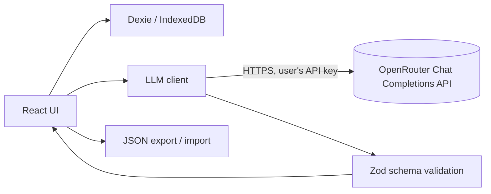

# Imitatio — Syntax & Discourse Pattern Notebook for Ancient Greek and Latin

**Product Specification — v0.1 (Draft for review)**

| Field | Value |
|---|---|
| Working title | Imitatio (placeholder; see Open Questions) |
| Owner | Saturday Israel Duff |
| Date | 25 September 2026 |
| Status | Draft — for offline review |
| Type | Frontend-only side project |
| Stack | React + TypeScript + Vite, IndexedDB (via Dexie), browser-direct LLM calls via OpenRouter (bring-your-own-key) |

---

## 1. Overview

Imitatio is a personal notebook for studying how Ancient Greek and Latin sentences and passages are built. The user pastes a chunk of text — a sentence, a period, or a short paragraph — and the app produces detailed explanatory notes covering its grammar, syntax, and discourse. The analysis is saved as a reusable **pattern**. On request, the app generates new text that follows a saved pattern, so the user can see the same structure carrying different content.

The project sits in the classical tradition of *imitatio*: learning to read and write well by analysing a model and reproducing its structure with new matter. The app automates the analysis and makes the imitation repeatable.

### 1.1 Core loop

```
Paste text → Analyse (LLM) → Review / edit notes → Save as pattern → Generate new text from pattern
```

### 1.2 Design principle

Every saved entry has **two layers**:

1. **Notes** — readable explanations for the human (grammar, syntax, discourse, style), with grammar references.
2. **Skeleton** — a compact, structured, machine-readable description of the pattern.

Generation works from the skeleton, not from the prose notes. This is what makes "generate text with the same syntax and discourse" reliable rather than vaguely similar.

---

## 2. Goals and Non-Goals

### 2.1 Goals (MVP)

- Analyse Greek and Latin text at three levels: grammar (morphology), syntax (clauses, constructions, dependencies), and discourse (function, information structure, cohesion, particles/connectives).
- Present the analysis as clear, well-explained notes suitable for an intermediate reader.
- Save analyses and patterns locally in the browser, organised by tags, source, construction, and device.
- Generate new Greek or Latin text from any saved pattern, optionally on a user-supplied topic.
- Make Greek input practical through a Beta Code converter.
- Work with no backend: static hosting, user-supplied OpenRouter API key, local storage, JSON export/import for backup.

### 2.2 Non-goals (MVP)

- No user accounts, sync, or server.
- No treebank integration or parser-based verification (see Roadmap).
- No automatic correction of the user's own compositions (planned for v2).
- No support for languages other than Ancient Greek and Latin.
- No guarantee of scholarly accuracy; the app is transparent about the limits of LLM analysis (see §12).

---

## 3. Users and Use Cases

**Primary user:** an intermediate-to-advanced reader of Greek or Latin (seminary student, classics student, self-learner) who can parse basic forms but wants to internalise how real authors build sentences and arguments.

| # | Use case |
|---|---|
| UC1 | "I just read a hard sentence in Thucydides. Explain exactly how it works." |
| UC2 | "Save this Ciceronian period so I can come back to its structure later." |
| UC3 | "Show me every pattern I've saved that uses a genitive absolute." |
| UC4 | "Write a new Greek sentence with the same structure as this Xenophon sentence, about a merchant arriving in a city." |
| UC5 | "Generate three variations of this pattern so I can see what stays fixed and what varies." |
| UC6 | "Back up my notebook and move it to another computer." |

---

## 4. Scope

### 4.1 MVP (v1)

- Settings: OpenRouter API key, model choice, default language, display preferences.
- Analyse screen: text input (with Beta Code for Greek), source metadata, analysis request, rendered results.
- Pattern card: notes + skeleton view, inline editing, tags.
- Notebook: list, search, filter by language/author/construction/device/tag.
- Generate: pick a pattern, optional topic and constraints, produce new text with translation and a unit-by-unit mapping.
- Export/import the whole notebook as JSON.

### 4.2 Input size limits (MVP)

| Level | Limit | Token-level table included? |
|---|---|---|
| Sentence | up to ~60 words | Yes |
| Period | up to ~120 words | Yes |
| Paragraph | up to ~250 words | No (summary-level grammar only, to control cost and output size) |

Limits are soft; the UI warns rather than blocks.

---

## 5. Architecture

### 5.1 Overview



There is no application server. The browser talks directly to OpenRouter using the user's own key, and all data lives in IndexedDB on the user's machine.

### 5.2 Technology choices

| Concern | Choice | Notes |
|---|---|---|
| Framework | React 18+ with TypeScript, Vite | |
| Routing | React Router | Five routes (see §9) |
| Storage | IndexedDB via Dexie | `dexie-react-hooks` `useLiveQuery` for reactive reads |
| Validation | Zod | Validates every LLM response before it is shown or saved |
| Styling | Tailwind CSS | |
| Markdown rendering | `react-markdown` + sanitisation | LLM text is never injected as raw HTML |
| Fonts | Gentium Plus (bundled locally) | Full polytonic Greek coverage; works offline |
| Hosting | Any static host (Vercel, Netlify, GitHub Pages) | |
| Optional | PWA manifest + service worker | Lets the notebook open offline; LLM features still need a connection |

### 5.3 Project structure

```
src/
  app/                 # routes, layout, providers
  features/
    analyze/           # input form, analysis request, results view
    pattern/           # pattern card, notes renderer, skeleton viewer, editors
    notebook/          # list, filters, search
    generate/          # generation form and results
    settings/          # API key, model, preferences
  lib/
    llm/               # client, prompts, response schemas (zod), repair logic
    db/                # Dexie schema, repositories, migrations
    greek/             # Beta Code converter, Unicode normalisation
    export/            # export/import and merge
  components/          # shared UI (tag input, confidence badge, etc.)
  types/               # shared TypeScript types (§6, §7)
```

---

## 6. Data Model

### 6.1 Entities

```ts
type Language = 'grc' | 'la';
type Level = 'sentence' | 'period' | 'paragraph';
type Confidence = 'high' | 'medium' | 'low';

interface Passage {
  id: string;                 // uuid
  language: Language;
  variety?: 'attic' | 'ionic' | 'homeric' | 'koine' | 'classical_latin' | 'late_latin' | 'other';
  text: string;               // NFC-normalised
  source?: {
    author?: string;          // "Xenophon"
    work?: string;            // "Anabasis"
    locus?: string;           // "1.1.1"
  };
  createdAt: number;
}

interface Entry {
  id: string;
  passageId: string;
  language: Language;
  level: Level;
  title: string;              // user-editable; defaults to skeleton.summary
  notes: AnalysisNotes;       // §6.2
  skeleton: PatternSkeleton;  // §7
  tags: string[];
  constructionKeys: string[]; // denormalised from skeleton, for indexing
  deviceKeys: string[];       // denormalised from skeleton, for indexing
  userEdited: boolean;
  model: string;              // model that produced the analysis
  createdAt: number;
  updatedAt: number;
}

interface Generation {
  id: string;
  entryId: string;
  request: {
    topic?: string;
    constraints?: string;     // free text, e.g. "use a different verb of motion"
    variations: number;       // 1–3
  };
  outputs: GeneratedText[];
  model: string;
  createdAt: number;
}

interface GeneratedText {
  text: string;               // NFC-normalised
  literalTranslation: string;
  unitMapping: { unitId: string; text: string }[];  // which part realises which skeleton unit
  deviations: string[];       // model's own report of where it departed from the pattern
  label: 'composition';       // always; never presented as authentic text
  starred: boolean;
}

interface Setting {
  key: string;                // 'apiKey' | 'model' | 'defaultLanguage' | 'betaCodeInput' | ...
  value: unknown;
}
```

### 6.2 Analysis notes

```ts
interface AnalysisNotes {
  overview: string;                   // 2–4 sentence plain-language summary
  translation: {
    literal: string;
    idiomatic: string;
  };
  tokens?: TokenAnalysis[];           // omitted at paragraph level
  syntax: {
    clauseMap: string;                // indented outline of clause structure
    constructions: NoteItem[];
  };
  discourse: NoteItem[];              // function, information structure, cohesion, particles
  style: NoteItem[];                  // devices, rhythm, periodicity
}

interface TokenAnalysis {
  index: number;
  form: string;
  lemma: string;
  pos: string;                        // noun, verb, participle, particle...
  parse: string;                      // "aor. act. ptc. nom. sg. masc."
  gloss: string;
  function: string;                   // "subject of γίγνονται", "abl. absolute with..."
  headIndex?: number;                 // token this word depends on
  confidence: Confidence;
}

interface NoteItem {
  title: string;                      // "Genitive absolute"
  explanation: string;                // the teaching note (markdown)
  evidence: string[];                 // the exact words in the text this refers to
  reference?: {
    grammar: 'Smyth' | 'Denniston' | 'Allen & Greenough' | 'Gildersleeve & Lodge' | 'Wallace' | 'Runge' | 'BDF' | 'other';
    section: string;                  // "§2070"
    verified: boolean;                // always false when produced by the LLM (see §12)
  };
  confidence: Confidence;
}
```

### 6.3 Dexie schema

```ts
db.version(1).stores({
  passages:    'id, language, source.author, createdAt',
  entries:     'id, passageId, language, level, *tags, *constructionKeys, *deviceKeys, createdAt, updatedAt',
  generations: 'id, entryId, createdAt',
  settings:    'key',
});
```

The `*` prefix makes `tags`, `constructionKeys`, and `deviceKeys` multi-entry indexes, so "every pattern with a genitive absolute" is a direct index lookup.

Schema changes are handled through Dexie version upgrades. Every stored skeleton and export file carries a `schemaVersion` so older data can be migrated.

---

## 7. Pattern Skeleton Schema

The skeleton is the core of the product. It describes a pattern abstractly enough to be reused with new content, but concretely enough that generated text is recognisably the same structure.

### 7.1 Type definitions

```ts
interface PatternSkeleton {
  schemaVersion: 1;
  language: Language;
  variety?: Passage['variety'];
  level: Level;
  summary: string;              // one-line formula, e.g. "Fronted gen. of origin + historic present + μέν…δέ apposition"
  units: PatternUnit[];         // in surface order
  devices: StyleDevice[];
  discourse: DiscourseProfile;
  invariants: string[];         // what MUST be preserved in generation
  freeSlots: string[];          // what MAY change in generation
  children?: PatternSkeleton[]; // paragraph level: nested sentence patterns (v2)
}

interface PatternUnit {
  id: string;                   // "U1", "U2"...
  kind: 'clause' | 'phrase';
  role: 'main' | 'subordinate' | 'participial' | 'infinitival' | 'absolute'
      | 'appositive' | 'parenthetical' | 'relative';
  construction?: string;        // key from the controlled vocabulary (§7.3)
  headsTo?: string;             // id of the unit this one depends on
  connective?: string;          // μέν, δέ, γάρ, autem, enim, cum...
  verb?: VerbConstraint;
  slots: Slot[];                // in surface order
  note?: string;
}

interface VerbConstraint {
  finite: boolean;
  mood?: 'indicative' | 'subjunctive' | 'optative' | 'imperative' | 'infinitive' | 'participle'
       | 'gerund' | 'gerundive' | 'supine';
  tense?: 'present' | 'imperfect' | 'future' | 'aorist' | 'perfect' | 'pluperfect' | 'future_perfect';
  voice?: 'active' | 'middle' | 'passive' | 'middle_passive' | 'deponent';
  person?: 1 | 2 | 3;
  number?: 'singular' | 'dual' | 'plural';
  specialUse?: string;          // "historic_present", "gnomic_aorist", "historic_infinitive"...
}

interface Slot {
  position: number;
  function: 'subject' | 'verb' | 'object' | 'indirect_object' | 'predicate' | 'genitive_modifier'
          | 'attribute' | 'apposition' | 'adverbial' | 'prepositional_phrase' | 'particle'
          | 'conjunction' | 'vocative' | 'other';
  case?: 'nominative' | 'genitive' | 'dative' | 'accusative' | 'ablative' | 'vocative';
  realization?: string;         // "proper_noun", "noun_plus_numeral", "articular_infinitive"...
  informationStatus?: 'topic' | 'contrastive_topic' | 'focus' | 'neutral';
  exampleText: string;          // the words from the source passage filling this slot
}

interface StyleDevice {
  type: string;                 // key from the device vocabulary (§7.3)
  span: string[];               // unit ids
  description: string;
}

interface DiscourseProfile {
  function: string;             // "narrative_opening", "argumentative_ground", "speech_introduction"...
  moves: { unitId: string; move: string }[];   // move keys from §7.3
  informationStructure: string; // prose explanation of topic/focus and word order
  cohesion: string[];           // how the unit links internally and to surrounding text
  register?: string;
}
```

### 7.2 Worked example — Xenophon, *Anabasis* 1.1.1

> Δαρείου καὶ Παρυσάτιδος γίγνονται παῖδες δύο, πρεσβύτερος μὲν Ἀρταξέρξης, νεώτερος δὲ Κῦρος.

```json
{
  "schemaVersion": 1,
  "language": "grc",
  "variety": "attic",
  "level": "sentence",
  "summary": "Fronted genitive of origin + historic present + numeral subject distributed by μέν…δέ apposition",
  "units": [
    {
      "id": "U1",
      "kind": "clause",
      "role": "main",
      "verb": { "finite": true, "mood": "indicative", "tense": "present", "voice": "middle",
                "person": 3, "number": "plural", "specialUse": "historic_present" },
      "slots": [
        { "position": 1, "function": "genitive_modifier", "case": "genitive",
          "realization": "coordinated_proper_nouns", "informationStatus": "topic",
          "exampleText": "Δαρείου καὶ Παρυσάτιδος" },
        { "position": 2, "function": "verb", "exampleText": "γίγνονται" },
        { "position": 3, "function": "subject", "case": "nominative",
          "realization": "noun_plus_numeral", "informationStatus": "focus",
          "exampleText": "παῖδες δύο" }
      ]
    },
    {
      "id": "U2",
      "kind": "phrase",
      "role": "appositive",
      "headsTo": "U1",
      "construction": "men_de_antithesis",
      "connective": "μέν",
      "slots": [
        { "position": 1, "function": "attribute", "case": "nominative",
          "realization": "comparative_adjective", "informationStatus": "contrastive_topic",
          "exampleText": "πρεσβύτερος" },
        { "position": 2, "function": "particle", "exampleText": "μὲν" },
        { "position": 3, "function": "apposition", "case": "nominative",
          "realization": "proper_noun", "exampleText": "Ἀρταξέρξης" }
      ]
    },
    {
      "id": "U3",
      "kind": "phrase",
      "role": "appositive",
      "headsTo": "U1",
      "construction": "men_de_antithesis",
      "connective": "δέ",
      "slots": [
        { "position": 1, "function": "attribute", "case": "nominative",
          "realization": "comparative_adjective", "informationStatus": "contrastive_topic",
          "exampleText": "νεώτερος" },
        { "position": 2, "function": "particle", "exampleText": "δὲ" },
        { "position": 3, "function": "apposition", "case": "nominative",
          "realization": "proper_noun", "exampleText": "Κῦρος" }
      ]
    }
  ],
  "devices": [
    { "type": "antithesis", "span": ["U2", "U3"],
      "description": "Two parallel comparative + name pairs set against each other by μέν…δέ." },
    { "type": "ellipsis", "span": ["U2", "U3"],
      "description": "No verb in the appositive members; the structure of U1 carries them." },
    { "type": "isocolon", "span": ["U2", "U3"],
      "description": "The two members are near-equal in length and identical in shape." }
  ],
  "discourse": {
    "function": "narrative_opening",
    "moves": [
      { "unitId": "U1", "move": "participant_introduction" },
      { "unitId": "U2", "move": "elaboration" },
      { "unitId": "U3", "move": "elaboration" }
    ],
    "informationStructure": "The parents are fronted as the frame of the narrative; the two sons are the new information, placed after the verb, then individuated one by one.",
    "cohesion": ["δύο sets up a set of two that μέν…δέ then distributes member by member."],
    "register": "plain historical narrative"
  },
  "invariants": [
    "Genitive of origin fronted before the verb",
    "Historic present of a verb of coming-to-be or existing",
    "Numeral in the subject matching the number of appositive members",
    "Appositive members in the shape [adjective] μέν [name], [adjective] δέ [name], with no verb"
  ],
  "freeSlots": [
    "Names of the parents and children",
    "The choice of verb within the same semantic class",
    "The contrasting adjectives (e.g. older/younger, wiser/bolder)"
  ]
}
```

### 7.3 Controlled vocabularies

Controlled keys make search and filtering reliable. The LLM must use these keys; if nothing fits, it returns `other:<short description>`, which the UI shows as a custom chip.

**Greek constructions (`grc`)**

| Key | Meaning |
|---|---|
| `gen_absolute` | Genitive absolute |
| `circumstantial_ptc` | Circumstantial participle (temporal, causal, concessive, etc.) |
| `attributive_ptc` | Attributive / substantival participle |
| `supplementary_ptc` | Supplementary participle (with τυγχάνω, λανθάνω, φαίνομαι...) |
| `articular_inf` | Articular infinitive |
| `acc_inf_indirect_statement` | Indirect statement with accusative + infinitive |
| `ptc_indirect_statement` | Indirect statement with participle |
| `hoti_indirect_statement` | Indirect statement with ὅτι / ὡς |
| `purpose_clause` | Purpose clause (ἵνα, ὅπως, ὡς + subj./opt.) |
| `purpose_fut_ptc` | Future participle of purpose |
| `result_clause` | Result clause (ὥστε + inf./indic.) |
| `cond_simple` / `cond_fmv` / `cond_flv` / `cond_contrary` / `cond_general` | Conditional types |
| `temporal_clause` | Temporal clause |
| `causal_clause` | Causal clause |
| `relative_clause` | Relative clause |
| `men_de_antithesis` | μέν…δέ correlation |
| `potential_optative` | Potential optative with ἄν |
| `deliberative_subj` | Deliberative subjunctive |
| `historic_present` | Historic present |

**Latin constructions (`la`)**

| Key | Meaning |
|---|---|
| `abl_absolute` | Ablative absolute |
| `acc_inf_indirect_statement` | Indirect statement |
| `indirect_question` | Indirect question |
| `ut_purpose` / `ut_result` | Purpose / result clauses |
| `rel_purpose` / `rel_characteristic` | Relative clause of purpose / characteristic |
| `cum_circumstantial` / `cum_causal` / `cum_concessive` | *cum* clauses |
| `fear_clause` | Clause of fearing (*ne* / *ut*) |
| `gerund` / `gerundive_attraction` / `gerundive_obligation` | Gerund and gerundive uses |
| `periphrastic_active` / `periphrastic_passive` | Periphrastic conjugations |
| `supine` | Supine |
| `historic_infinitive` | Historic infinitive |
| `dum_clause` | *dum* / *donec* / *quoad* clauses |
| `cond_simple` / `cond_fmv` / `cond_flv` / `cond_contrary` | Conditional types |
| `relative_clause` | Relative clause |

**Style devices (shared)**

`hyperbaton`, `chiasmus`, `antithesis`, `isocolon`, `tricolon`, `anaphora`, `asyndeton`, `polysyndeton`, `ellipsis`, `periodic_structure`, `loose_structure`, `litotes`, `alliteration`, `parenthesis`.

**Discourse moves (shared)**

`setting`, `participant_introduction`, `event`, `background`, `ground` (γάρ / *enim*), `inference` (οὖν / *igitur*), `contrast`, `concession`, `elaboration`, `example`, `climax`, `conclusion`, `speech_introduction`, `transition`.

The vocabularies live in `src/lib/llm/vocab.ts`, are inserted into the prompts, and are versioned alongside the schema.

---

## 8. LLM Integration

### 8.1 Client

Calls go directly from the browser to the OpenRouter Chat Completions API (OpenAI-compatible) using the user's OpenRouter key:

```ts
const res = await fetch('https://openrouter.ai/api/v1/chat/completions', {
  method: 'POST',
  headers: {
    'content-type': 'application/json',
    'authorization': `Bearer ${apiKey}`,
    'HTTP-Referer': location.origin,   // optional; identifies the app to OpenRouter
    'X-Title': 'Imitatio',             // optional; app name shown in OpenRouter usage
  },
  body: JSON.stringify({
    model,                 // OpenRouter model slug from settings, e.g. "vendor/model-name"
    max_tokens: 8000,
    messages: [
      { role: 'system', content: SYSTEM_PROMPT },
      { role: 'user', content: userPrompt },
    ],
    response_format: { type: 'json_object' },  // sent only when the chosen model supports it
  }),
});
const text = (await res.json()).choices[0].message.content;
```

The model is a setting, stored as an OpenRouter model slug. Separate models can be chosen for analysis and for generation (a higher-quality model as the recommended default for analysis, and a cheaper, faster one for quick generations). The picker is populated from OpenRouter's public model list (`GET https://openrouter.ai/api/v1/models`), cached locally, and also accepts a free-text slug. The LLM layer sits behind a small interface (`analyze()`, `generate()`) so another provider could be added later without touching the UI.

### 8.2 Response handling

1. Strip any accidental code fences and parse JSON.
2. Validate with Zod against the expected schema.
3. If parsing or validation fails, send **one repair request** containing the original output and the validation errors, asking for corrected JSON only.
4. If repair also fails, show the raw output in a collapsible panel with a "Try again" button. Nothing invalid is saved.

### 8.3 Client-side checks (cheap verification without a parser)

Even without a parser, some errors can be caught in the browser:

- **Evidence check:** every `NoteItem.evidence` string and every `Slot.exampleText` must be an exact substring of the passage (after normalisation, §10.3). Mismatches are flagged with a warning badge.
- **Token check:** the `tokens[].form` values, in order, must reproduce the passage's words. Mismatches are flagged.
- **Vocabulary check:** construction, device, and move keys must be in the vocabulary or use the `other:` prefix.
- **Generation check:** every `unitMapping.text` must appear in the generated text, and every connective listed in the skeleton (μέν, δέ, γάρ, *autem*...) must be present, compared accent-insensitively (so μὲν matches μέν).

### 8.4 Draft prompts

**Analysis — system prompt (draft)**

```
You are an expert philologist in Ancient Greek and Latin and an experienced teacher.
Analyse the passage the user gives you at three levels: grammar, syntax, and discourse.

Write for an intermediate student. For every construction you identify, say:
(1) what it is, (2) the formal clues that show it (endings, particles, word order),
and (3) what it contributes to the meaning of the passage.

Rules:
- Use traditional grammatical terminology.
- Cite a section of a standard grammar (Smyth, Denniston, Allen & Greenough,
  Gildersleeve & Lodge, Wallace, Runge, BDF) only when you are confident of it.
  Otherwise omit the reference.
- Mark every note and every token with a confidence of high, medium, or low.
- "evidence" and "exampleText" must be exact substrings of the passage.
- Use only the construction, device, and move keys provided. If none fit,
  use "other:<short description>".
- Do not correct, normalise, or rewrite the passage.

Return ONLY a JSON object with the keys "notes" and "skeleton", matching the
schema below. No prose, no code fences.

<schema> ... </schema>
<vocabularies> ... </vocabularies>
```

**Analysis — user prompt (template)**

```
Language: {grc|la} ({variety})
Level: {sentence|period|paragraph}
Source: {author}, {work} {locus}
Include token table: {yes|no}

Passage:
{text}
```

**Generation — system prompt (draft)**

```
You compose new Ancient Greek or Latin text that follows a given structural pattern.

You will receive a pattern skeleton. Write NEW text in the same language that:
- realises every unit, in the same order;
- preserves every item listed in "invariants";
- keeps the specified constructions, moods, tenses, particles/connectives,
  style devices, discourse moves, and topic/focus positions;
- changes only what "freeSlots" allows, following the user's topic if given.

Use correct morphology and idiom for the stated variety. For Greek, write full
polytonic accentuation and breathings. For Latin, use classical orthography
without macrons unless asked.

For each output, give a literal English translation, map each unit id to the
words that realise it, and list honestly any place where you departed from
the pattern.

Return ONLY JSON: { "outputs": [ { "text", "literalTranslation",
"unitMapping": [ { "unitId", "text" } ], "deviations": [] } ] }
```

### 8.5 Error handling

| Case | Behaviour |
|---|---|
| No API key | Route to Settings with an explanation |
| 401 | "Your API key was rejected" with a link to Settings |
| 402 | "Your OpenRouter account is out of credits" with a link to OpenRouter |
| 429 / 502 / 503 (rate-limited or upstream model unavailable) | Automatic retry with backoff (up to 3 attempts), then a clear message |
| Network failure | Message with retry; the input is never lost |
| Oversized input | Soft warning before sending (§4.2) |
| Invalid JSON after repair | Raw output shown; nothing saved |

The input text is saved as a draft in IndexedDB as the user types, so a failed request never loses work.

---

## 9. Screens and UX

### 9.1 Routes

| Route | Screen |
|---|---|
| `/` | Notebook (home) |
| `/analyze` | Analyse a new passage |
| `/entry/:id` | Pattern card (tabs: Notes, Skeleton, Tokens, Generations) |
| `/entry/:id/generate` | Generate from this pattern |
| `/settings` | API key, model, preferences, export/import |

On first launch with no key, the app opens a short onboarding panel in Settings.

### 9.2 Analyse

- Language toggle (Greek / Latin) and variety dropdown.
- Level selector (sentence / period / paragraph), with a word-count indicator against the limits in §4.2.
- Text area with a **Beta Code** toggle for Greek (§10). Live preview of the converted Unicode.
- Optional source fields: author, work, locus.
- "Analyse" button with a progress state. On success, the result opens as an unsaved pattern card with "Save to notebook" and "Discard".

### 9.3 Pattern card

**Header:** title (editable), source, language badge, tags (editable), warning badges from §8.3 checks.

**Passage view:** the passage displayed large in Gentium Plus. Clicking a word highlights its token row. Clicking a note highlights its evidence in the passage.

**Notes tab:** overview; literal and idiomatic translation; collapsible sections for Syntax (clause map plus construction notes), Discourse, and Style. Each note shows its confidence badge and its grammar reference (marked "unverified"). All text is editable inline; any edit sets `userEdited: true`.

**Skeleton tab:** the pattern shown as a horizontal strip of unit boxes in surface order. Each box shows its role, construction chip, connective, and slots with their example text. Dependencies (`headsTo`) are drawn as simple connectors. Invariants and free slots are listed below. A "View JSON" toggle opens a JSON editor that validates against the schema before saving.

**Tokens tab:** a table of form, lemma, parse, gloss, function, and confidence (sentence and period level only).

**Generations tab:** all previous generations for this pattern, starred ones first.

### 9.4 Generate

- Topic field (optional), e.g. "a merchant arriving in Corinth".
- Constraints field (optional), e.g. "use a verb of motion", "make it about Ephesus".
- Variations: 1–3.
- Results appear side by side with the original. Each output shows its text, literal translation, and a colour-coded unit mapping that matches the Skeleton strip, so the user can see which new words fill which slot. Deviations and check warnings are shown clearly. Every output carries a visible "Composition — not authentic text" label.
- Actions: star, copy, delete.

### 9.5 Notebook

- Search box (full text across titles, passage text, and notes; accent-insensitive).
- Filters: language, level, author, construction, device, discourse move, tag.
- List of cards showing title, a short passage excerpt, language, source, and construction chips.
- Sort by newest, oldest, or recently edited.

### 9.6 Settings

API key (with show/hide and a "don't store, ask each session" option), model, default language and variety, Beta Code input on by default, font size, light/dark mode, export and import.

---

## 10. Greek and Latin Input

### 10.1 Beta Code converter

Greek can be typed in Beta Code and converted live to polytonic Unicode. Direct paste of Unicode Greek always works too.

| Beta Code | Greek | | Beta Code | Greek |
|---|---|---|---|---|
| `a b g d e z h q` | α β γ δ ε ζ η θ | | `)` | smooth breathing |
| `i k l m n c o p` | ι κ λ μ ν ξ ο π | | `(` | rough breathing |
| `r s t u f x y w` | ρ σ τ υ φ χ ψ ω | | `/` `\` `=` | acute, grave, circumflex |
| `*` + letter | capital | | `\|` | iota subscript |
| `s` at word end | ς (automatic) | | `+` | diaeresis |

Diacritics follow the letter, breathing before accent (`a)/` → ἄ). For capitals, diacritics come between the asterisk and the letter (`*)a` → Ἀ). The converter lives in `src/lib/greek/betacode.ts` with unit tests covering all combinations.

### 10.2 Latin

Plain Latin input needs no conversion. Macrons are preserved if present. For search only, text is matched with macrons stripped and u/v and i/j treated as equivalent.

### 10.3 Normalisation

- All stored Greek and Latin text is Unicode **NFC**. This also resolves the oxia/tonos duplication (for example, U+1F71 normalises to U+03AC), which otherwise breaks matching.
- Word-final σ is converted to ς.
- Elision marks (', ’, ᾽) are normalised to U+2019.
- For search and for the checks in §8.3, text is also compared in an accent- and breathing-insensitive form.

---

## 11. Search and Organisation

All filtering happens client-side on the Dexie indexes (`language`, `level`, `*tags`, `*constructionKeys`, `*deviceKeys`). Full-text search runs over an in-memory normalised index built at startup, which is fast enough for a notebook of a few thousand entries. Discourse moves are filtered in memory from the skeletons.

---

## 12. Accuracy and Honesty

Without a parser or treebank, the LLM is the only source of analysis, and it will sometimes be wrong. The app treats this as a design constraint, not a footnote.

- **Confidence badges** on every note and token.
- **Grammar references are marked "unverified"**, since section numbers produced by an LLM may be wrong. (A curated table of verified references is planned for v2.)
- **Client-side checks** (§8.3) flag the errors that can be detected cheaply.
- **Everything is editable.** The user is the final authority; edited entries are marked.
- **Generated text is always labelled "Composition"** and is never presented as authentic Greek or Latin.
- A short, permanent note on the About screen explains these limits.

---

## 13. Export and Import

**Export** produces a single JSON file:

```json
{
  "app": "imitatio",
  "schemaVersion": 1,
  "exportedAt": "2026-09-25T10:00:00Z",
  "passages": [],
  "entries": [],
  "generations": []
}
```

Settings and the API key are never exported.

**Import** offers two modes:

- **Merge (default):** records are matched by `id`. On conflict, the record with the later `updatedAt` wins. New records are added.
- **Replace:** clears the notebook after a confirmation dialog, then imports.

Older `schemaVersion` files are migrated on import.

---

## 14. Security and Privacy

- The API key is stored only in IndexedDB on the user's device, or held in memory only if "ask each session" is enabled. It is sent only to OpenRouter.
- Settings show a warning against storing the key on shared computers.
- All LLM output is rendered as sanitised Markdown; no raw HTML is ever injected.
- A Content Security Policy restricts network connections to `https://openrouter.ai`.
- There is no analytics or tracking in the MVP.

---

## 15. Non-Functional Requirements

| Area | Requirement |
|---|---|
| Performance | Notebook filtering feels instant (< 100 ms) with 1,000+ entries |
| Offline | Notebook browsing and editing work offline (with the PWA option); analysis and generation need a connection |
| Accessibility | Full keyboard navigation, visible focus, WCAG AA contrast, screen-reader labels on badges |
| Responsiveness | Desktop first; usable on tablet; readable on phone |
| Typography | Gentium Plus for Greek and Latin, adjustable size; clean polytonic rendering |
| Themes | Light and dark |
| Testing | Unit tests for Beta Code, normalisation, Zod schemas, client-side checks, and export/import merging |

---

## 16. Milestones

| Milestone | Deliverable | Done when |
|---|---|---|
| M0 | Scaffold | Vite + React + TS + Tailwind + Router + Dexie running; routes stubbed |
| M1 | Settings and LLM client | Key and model saved; a test call succeeds; errors handled per §8.5 |
| M2 | Analyse | A sentence produces validated notes and skeleton, rendered on the pattern card |
| M3 | Notebook | Entries save, edit, tag, search, and filter |
| M4 | Generate | Generations produced, checked, mapped to units, and stored |
| M5 | Input and polish | Beta Code, normalisation, export/import, dark mode, PWA option |

---

## 17. Roadmap (post-MVP)

- **Imitation-checking mode:** the user writes their own imitation of a pattern, and the app compares it against the skeleton and explains the differences.
- **English-to-pattern composition:** the user gives an English sentence, and the app renders it in Greek or Latin using a chosen pattern.
- **Verified grammar references:** a curated lookup table of Smyth and Allen & Greenough sections, with links to online editions.
- **Morphology verification:** checking generated forms against a morphological analyser (for example, a Morpheus-based service).
- **Authentic examples from treebanks:** finding real sentences that match a pattern in the Perseus and PROIEL treebanks, via preprocessed static data or a small backend.
- **Nested paragraph patterns:** full support for `children` in the skeleton.
- **Review mode:** spaced repetition of saved patterns.
- **Koine / New Testament profile:** tuned prompts and references (Wallace, Runge, BDF) for the Greek New Testament and the Septuagint.
- **Pattern packs:** sharing and importing curated sets of patterns.
- **Shared morphology layer** with the Παράδειγμα and Trelingo apps.

---

## 18. Open Questions

1. **Name.** Is "Imitatio" the right working title?
2. **Classical or Koine first?** This decides the default variety, the example passages used in testing, and which reference grammars the prompts favour.
3. **Default model and cost.** Which model should be the default for analysis versus generation?
4. **Token table.** Should it always be generated at sentence level, or only on request, to keep responses smaller?
5. **Latin macrons.** Should generated Latin include macrons by default?
6. **Sub-span patterns.** Should a user be able to select part of a passage and save only that span as its own pattern?
